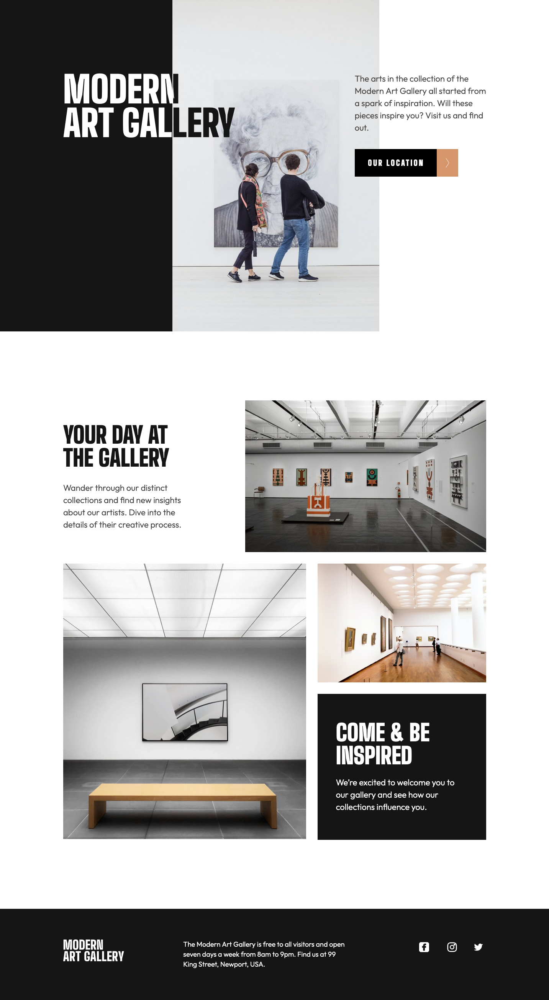

# Frontend Mentor - Art gallery website

This is a solution to the [Art gallery website challenge on Frontend Mentor](https://www.frontendmentor.io/challenges/art-gallery-website-yVdrZlxyA). Frontend Mentor challenges help you improve your coding skills by building realistic projects. 

## Table of contents

- [Overview](#overview)
  - [The challenge](#the-challenge)
  - [Screenshot](#screenshot)
  - [Links](#links)
  - [Built with](#built-with)
  - [What I learned](#what-i-learned)
  - [Continued development](#continued-development)
- [Author](#author)

## Overview
For this challenge, I needed to reproduce a two-page website from a Figma design. The design had a mobile, tablet, and desktop layout.The site has internal links as well as links to social media sites that all have hover effects that change the color. As a bonus, I added a transition property to the text on the home page. It loads at a slight delay as the user scrolls down the page to give it movement.

### The challenge

Users should be able to:

- View the optimal layout for each page depending on their device's screen size
- See hover states for all interactive elements throughout the site

### Screenshot




### Links

- Solution URL: [Add solution URL here](https://www.frontendmentor.io/solutions/responsive-2page-site-for-art-museum-EsEuZqCqt9)
- Live Site URL: [Add live site URL here](https://stacy-riley.github.io/art-gallery-website/)

### Built with

- Semantic HTML5 markup
- CSS
- Flexbox
- Bootstrap
- Mobile-first workflow
- JavaScript

### What I learned

I learned some interesting CSS and JavaScript tricks during this project. The 2-tone letter found in the desktop view of the home page was a nice feature to learn.  I had a chance to work with svg files as well and liked how I can adjust the color of the icon right in the file. Also, I went a little above and beyond with adding the text transition to the home page. It turned out to be a nice property to give the page some more interest.

Here are some code snippets, see below:

```css
/* Styles for the 2-color "N" in the title of desktop view */
  .header-span-two-color-letter {
    background: linear-gradient(to right, #ffffff 0%, #ffffff 66.666%, #151515 66.666%, #151515 100%);
    -webkit-background-clip: text;
    background-clip: text;
    color: transparent;
  }
  /* The background-clip: text property ensures that the gradient is applied only to the text content, and color: transparent makes the text color transparent, revealing the gradient background. */
  /* The Linear-gradient property explained:
  to right: This specifies the direction of the gradient, indicating that it should go from left to right.

		#ffffff 0%: At the start (0%), the color is #ffffff, which is white.

		#ffffff 66.666%: At 66.666%, it's still #ffffff, so two-thirds of the way, it's still white.

		#151515 66.666%: At the same position (66.666%), the color transitions to #151515, which is a dark gray.

		#151515 100%: From 66.666% to 100%, the color remains #151515, ensuring that the dark gray color continues to the end. */
```
```js
//Function to check if the element is in the viewport:
function isInViewport(element) {
	
/*Returns a DOMRect object representing the size 
of the element and its position relative to the viewport.
*/
const rect = element.getBoundingClientRect(); 
	
	return (
		rect.top >= 0 &&
		rect.left >= 0 &&
		rect.bottom <= (window.innerHeight || document.documentElement.clientHeight) &&
		rect.right <= (window.innerWidth || document.documentElement.clientWidth)
	);
}

//Function to handle the scroll event in body and footer sections:
function handleScroll() {
	const textEl = document.querySelectorAll('.slow-reveal');
	textEl.forEach(text => {
		if(isInViewport(text)){
			//Makes the text visible once it's in the viewport
			text.style.opacity = '1';
		}
	})
}

//Function to fade in the header section:
function fadeInHeader() {
	const header = document.querySelectorAll('.slow-load');
	header.forEach(element => {
		element.style.opacity = '1';
	})
}

//Scroll event listener:
window.addEventListener('scroll', handleScroll);

//Slow load header event listener:
window.addEventListener('DOMContentLoaded', function(){
	setTimeout(fadeInHeader, 500); /*Delay the function execution: 1000ms = 1 second)*/
})
```

### Continued development

I plan on continuing to learn more about how to use CSS and JavaScript to create impresive transitions to images and script on the page.  It gives the page movement and a bit of "wow" to a site and I believe my clients would enjoy having more features like this on their websites.

## Author

- Website - [Stacy Riley](https://www.createdbystacy.com)
- Frontend Mentor - [@Stacy-Riley](https://www.frontendmentor.io/profile/Stacy-Riley)
- Twitter - [@askstacyriley](https://twitter.com/AskStacyRiley)
